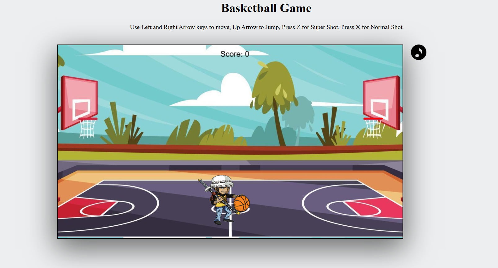
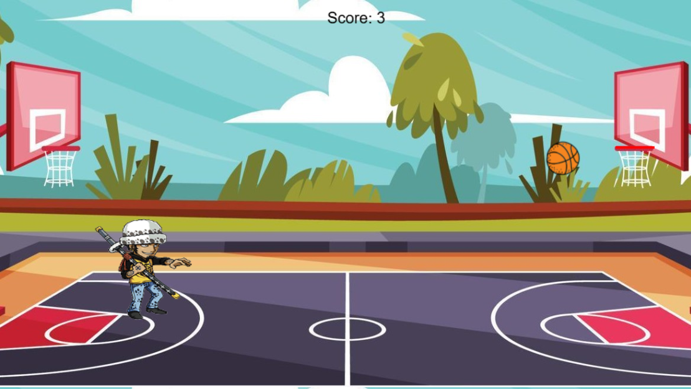

# basketball-game

A simple basketball game built using HTML5 Canvas and JavaScript. Players can move, jump, and shoot the basketball into the hoop to score points.

## Features
1. Player movement using arrow keys
2. Jumping mechanics
3. Ball pickup and shooting mechanics
4. Score tracking
5. Simple physics-based ball movement

## Controls
- Left Arrow (←): Move left
- Right Arrow (→): Move right
- Up Arrow (↑): Jump
- Z Key: Super Shot (Fast & High-Speed Shot)
- X Key: Normal Shot

## How to Play

- Move the player left or right using the arrow keys.
- Jump to pick up the ball if it is away from the player.
- Press Z for a super shot or X for a normal shot to throw the ball towards the hoop.
- Score points by getting the ball through the hoop.

## Installation & Running the Game

1. Clone the repository:
2. Open the index.html file in a web browser.

## Future Improvements

- Add sound effects for scoring and shooting
- Improve player and ball animations
- Implement different difficulty levels
- Mobile support with touch controls

# project images

